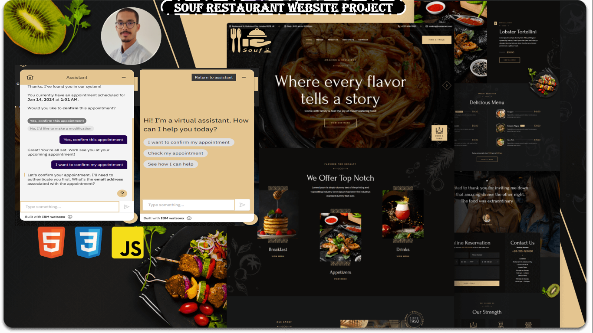

<div align="center">
  
  <h2 align="center">Souf Restaurant Website</h2>


  
</div>

<h1 style='color:#4c4893' align='center'>
    Welcom to my Restaurant Website Project using IBM Watson Assistant Chatbot.
</h1>


<div style="background-color:white; color:black; font-size:15px; font-family:Comic Sans MS; padding:10px; border: 5px solid black;font-weight:bold;border-radius: 20px;">
    Souf is a fully responsive restaurant website, <br />Responsive for all devices, build using HTML, CSS, and JavaScript.<br>
    and it includes a small IBM Watson Assistant
    <br>
  <a href="https://github.com/SoufianeElghazi/Souf.github.io"><strong style="color:orangered">➥ Live Demo</strong></a>

  <a href="https://www.youtube.com/watch?v=z6Zwg9YcZnI"><strong style="color:#4c4893">➥ Video </strong></a>
</div>

### Demo



### Prerequisites

Before you begin, ensure you have met the following requirements:

* [Git](https://git-scm.com/downloads "Download Git") must be installed on your operating system.

### Run Locally

To run **Souf** locally, run this command on your git bash:

Linux and macOS:

```bash
sudo git clone https://github.com/SoufianeElghazi/Souf.github.io.git
```

Windows:

```bash
git clone https://github.com/SoufianeElghazi/Souf.github.io.git
```


### License

[MIT](https://choosealicense.com/licenses/mit/)

<div style="background-color:#4c4893; color:white; font-size:15px; font-family:Comic Sans MS; padding:10px; border: 5px solid black;font-weight:bold;border-radius: 20px;text-align:center"> ✨ THE END ✨</div><br>